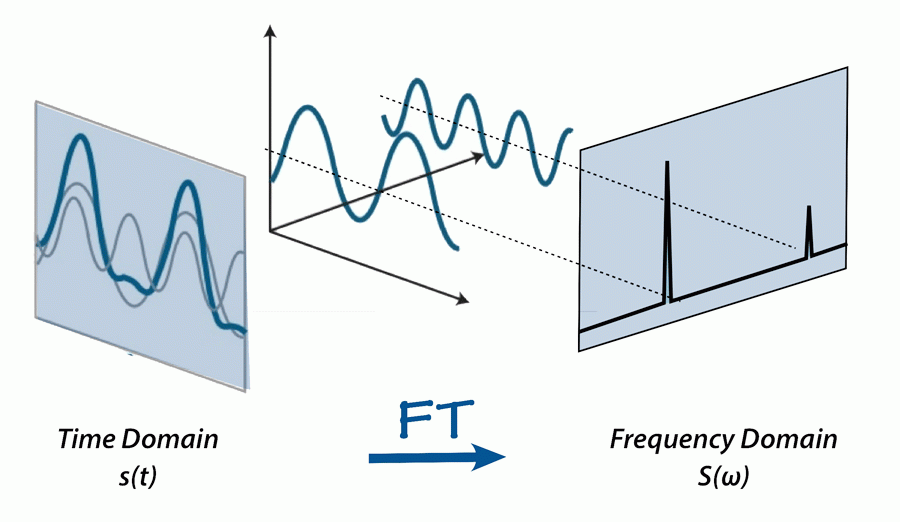

# Digital Signal Processing
This practical includes processing of digital signals using Fast Fourier Transform.

This practical describes how to perform some basic sound processing functions in Python. We’ll be using the numpy and matplotlib for data analysis and scipy to import/export wav files.
